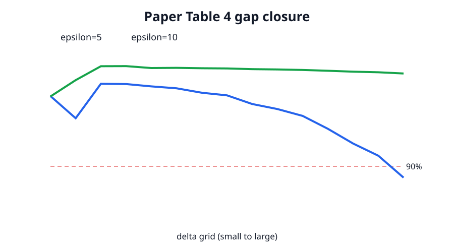

# Claim 3 — FALSIFIED

**Exact claim.** Appendix D.3 states that for ε≥5 the multi-Gaussian closes more than 90% of the analytic-Gaussian-to-theoretical-lower-bound gap for any δ>0, and up to 99%; Table 4 supplies the values.

**Direct source contradiction.** Table 4 reports 88.88% at ε=5, δ=0.25. Only 14/15 ε=5 cells exceed 90%; ε=10 ranges from 96.93% to 99.94%. This contradicts the exact “more than 90% … for any δ>0” quantifier.

**Privacy-assumption contradiction.** All 30 reported ε∈{5,10} mixture losses have rounding-robust DP witnesses. Thus those gap closures are not attained by the claimed `(ε,δ)`-DP mechanisms.

The negative control changes 88.88 to 90.01 and is rejected because the source-table contradiction disappears. Code: [claim3_gap_audit.py](../../code/current/repro/claim3_gap_audit.py). Raw: [claim JSON](../../evidence/current/claim3_gap_closure_audit.json), [source CSV](../../code/current/repro/data/table4_gap_tail.csv).

**Limit.** The Selvi lower-bound optimizer is not rerun because the reported mechanism already violates the claim's privacy premise. This does not rule out a different valid mechanism achieving a similar closure.
