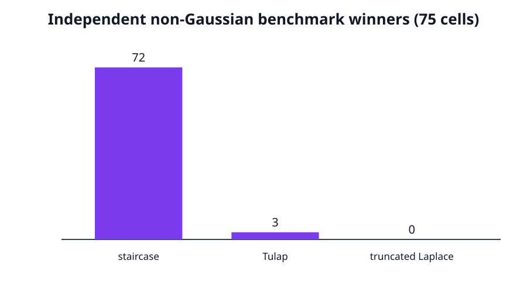

# Claim 5 — FALSIFIED

**Exact claim.** Table 2 compares the best Table 1 mixture with truncated Laplace, Tulap, staircase, cactus, and flipped Huber. Appendix D.6 says the benchmark winner is always truncated Laplace or Tulap and that mixtures are competitive in the low-privacy regime.

**Observed.** In the 75 ε≥2 cells, independently implemented truncated Laplace, Tulap, and optimal pure-DP staircase yield winners: staircase 72, Tulap 3, truncated Laplace 0. No cell is within 1 percentage point of the printed Table 2 value; mean absolute difference is 42.9803 points. More decisively, all 60 ε≥3 mixture entries have rounding-robust DP violations, so their comparison against valid benchmarks is not at equal privacy.

The staircase optimizer matches `1/(2 sinh(ε/2))` within 2.22×10⁻¹⁶; a 1% mutation is rejected. A separate Tulap control removes approximate-DP truncation and is rejected. Code: [claim5_benchmarks.py](../../code/current/repro/claim5_benchmarks.py). Raw: [claim JSON](../../evidence/current/claim5_non_gaussian_benchmark_audit.json), [Table 2 CSV](../../code/current/repro/data/table2_high_epsilon.csv).

**Limit.** Cactus and flipped Huber are source-audited only. The paper says neither wins, so neither can repair the independent staircase contradiction or the missing equal-privacy premise. Independent coverage is 75/150 cells.
