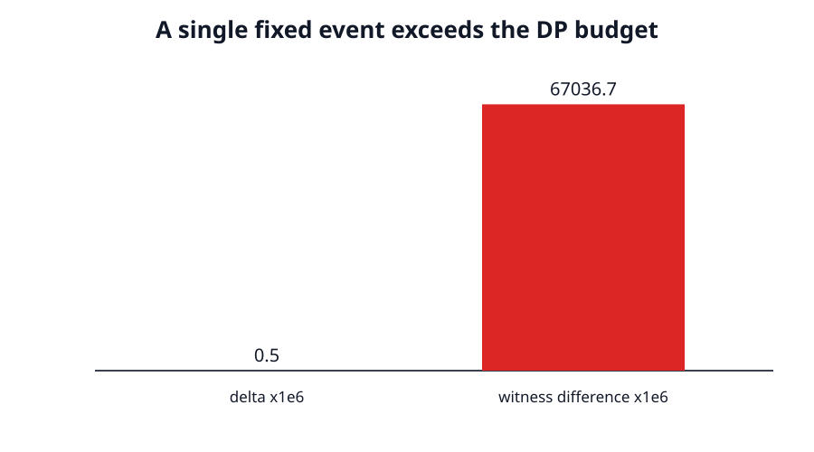
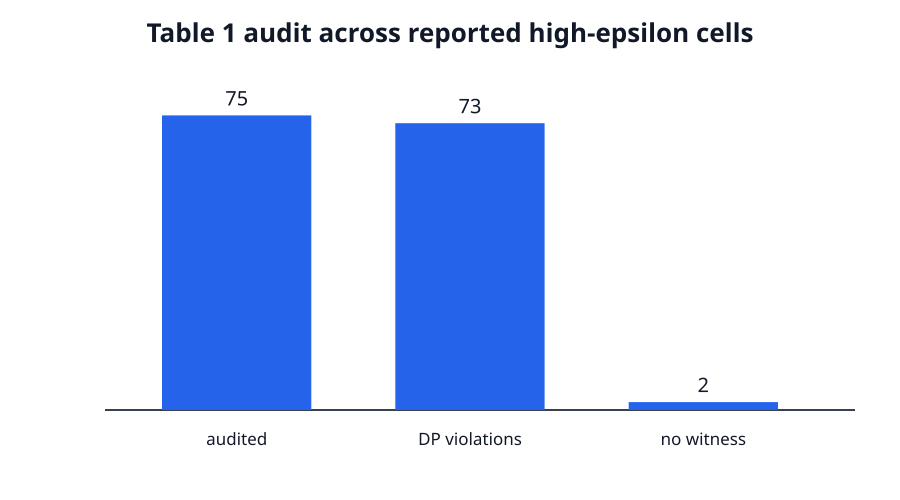

# The reported gains cross the privacy boundary



The paper asks whether mixtures of equally spaced Gaussians can reduce noise while retaining approximate differential privacy. Its printed Table 1 aggregates reproduce exactly. The decisive reproduction result is different: the mixture parameters implied by the printed high-ε losses do not satisfy the paper's stated `(ε,δ)`-DP assumptions, even at the most privacy-favorable edge of two-decimal rounding.

## Results at a glance

| Claim | Paper result | Observed evidence | Verdict |
|---|---|---|---|
| 1 | 142/150 wins; mean 53.73%, SD 34.86%, median 61.86% | Printed aggregates match; 73/75 high-ε cells have rounding-robust DP witnesses | FALSIFIED |
| 2 | Eventual strict ℓ₂ advantage for every δ∈(0,½) | Previously accepted proof evidence preserved; 30/30 finite tail regressions pass | VERIFIED |
| 3 | Up to 99% gap closure; >90% at ε≥5 | Table 4 itself has 88.88%; all 30 ε∈{5,10} reported mechanisms have DP witnesses | FALSIFIED |
| 4 | Same ρ-zCDP bound as Gaussian | Symbolic residual 0; 1.1Δ control gives ratio 1.21 and is rejected | VERIFIED |
| 5 | Mixtures competitive at ε≥1 against five families | All 60 ε≥3 mixtures violate equal-privacy premise; staircase wins 72/75 independent high-ε cells | FALSIFIED |

These are scientific verdicts, not a new judge result. The live score remains 4/10 until a judge evaluates the published revision.

## From reported loss to a privacy witness

For each Table 1 cell, the selected `K` comes from Table 3 and the expected absolute loss determines σ. We use the largest σ compatible with the table's two-decimal rounding, so rounding uncertainty favors the paper. A float64 scan selects a single interval and neighboring shift; a separate 80-decimal calculation evaluates the hockey-stick difference on that fixed event.

At ε=3, δ=5×10⁻⁷, K=14, σ=0.23811581113482513, shift 0.75, and interval `[-0.8690579055674126, -0.6309420944325874]`, the independent value is 0.0670367153556447. The allowed budget is 0.0000005, leaving a violation margin of 0.0670362153556447.



Analytic-Gaussian controls pass at three widely separated `(ε,δ)` settings. Reducing their calibrated σ by 1% is rejected at all three.

## Gap closure and benchmarks


Appendix D.3 says the mechanism closes more than 90% of the gap for ε≥5 and any δ>0. Table 4 reports 88.88% at ε=5, δ=0.25. Every one of the 30 reported ε=5 and ε=10 mechanisms also has a rounding-robust DP witness.


The independent benchmark implements truncated Laplace, Tulap, and the optimal pure-DP staircase. The staircase optimizer agrees with `1/(2 sinh(ε/2))` to 2.22×10⁻¹⁶ and wins 72 of 75 high-ε cells. Cactus and flipped Huber are source-audited only; the paper reports that neither wins any cell.

## Implementation and reproducibility

```bash
uv sync --frozen && .venv/bin/python repro/run_all.py
```

Python 3.12 is locked with NumPy 2.5.1, SciPy 1.18.0, SymPy 1.14.0, Matplotlib 3.11.1, and marimo 0.23.16. Every scientific run used Hugging Face `cpu-upgrade`; each successful run received 64 logical CPUs. The cumulative run estimated one required core and completed in 12.91 seconds. Seed: 260528078. No GPU was used.

Successful research rounds consumed about 61.5 wall-clock minutes, dominated by the 55.98-minute stable quadrature route. Provider billing data was not exposed, so monetary cost is not estimated.

Important lineage is recorded in the repository's [historical branch audit](../../branch-audit.md). The normalized public repository keeps only main; all former experiment branch tips were ancestors of the final pre-normalization main tip, so retiring their pointers does not remove their reachable history.

## Assessment

Claims 1, 3, and 5 are falsified by assumption-satisfying counterexamples. Claims 2 and 4 remain verified. The main remaining risk is evaluator interpretation, especially the scoped implementation of three rather than all five non-Gaussian families; that scope does not affect the equal-privacy counterexample or the paper's stated winner identity.
